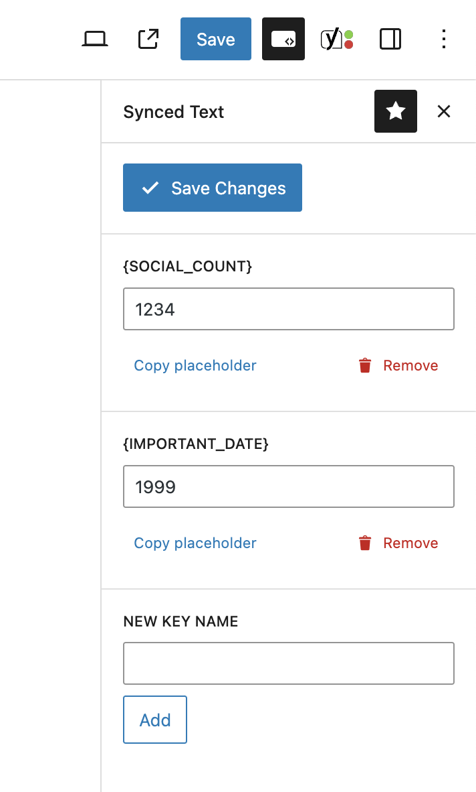

# Synced Text Snippets

This plugin allows you to create text snippets that can be used in multiple places. When you update a snippet, all the places where it is used will be updated as well.

Snippets are managed from the block editor sidebar. You can create a new snippet by clicking the "Add Snippet" button. You can also edit or delete snippets.

This plugin can replace the use of shortcodes designed to output inline text, this was possible in the classic editor, and in classic editor blocks but not in the block editor directly as shortcodes are converted to blocks which cannot be inline.

## Installation

1. Download the plugin from the [GitHub repository](https://github.com/humanmade/synced-text).
2. Upload the plugin to your site's `wp-content/plugins` directory.
3. Activate the plugin from the WordPress admin.
